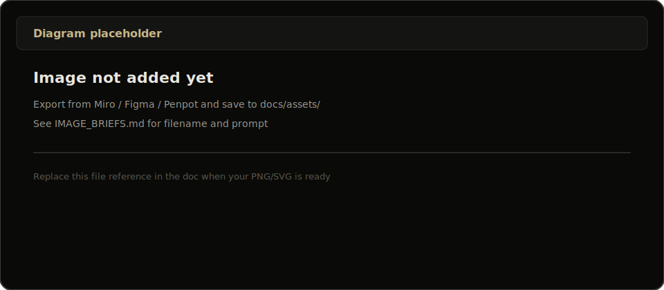

# Self-host BRIEFR

One guide for installing and running BRIEFR on your server.

---

## At a glance


> **Diagram:** [`assets/production-architecture.svg`](assets/production-architecture.svg) — [IMAGE_BRIEFS §1](https://github.com/Soldier0x0/briefr/blob/main/docs/IMAGE_BRIEFS.md#1-production-architecture)

| Piece | What |
|-------|------|
| App | FastAPI `:8000` + React static via nginx |
| Database | **PostgreSQL 16** (required) |
| Code | `/opt/briefr` |
| Backups | `/var/lib/briefr/backups` |

---

## Quick start (development)

```bash
git clone https://github.com/Soldier0x0/briefr.git
cd briefr/backend
python3 -m venv .venv && source .venv/bin/activate
pip install -r requirements-dev.txt
cp .env.example .env   # set DATABASE_URL
uvicorn main:app --host 0.0.0.0 --port 8000 --reload
```

```bash
cd ../frontend && npm install && npm run dev
```

Open http://localhost:5173. First visit → complete **setup** to create admin user.

**Sample data:** `python scripts/seed_screenshot_data.py` (from repo root, venv active).

**Postgres locally:** `docker compose -f deploy/docker-compose.postgres.yml up -d`

---

## Production

```bash
bash deploy/setup.sh
bash deploy/briefr-update.sh
```

| Checklist | Setting |
|-----------|---------|
| Database | `DATABASE_URL` in `backend/.env` |
| CORS | `ALLOWED_ORIGINS` = your public URL |
| Rate limits | `RATE_LIMIT_ENABLED=1` |
| Swagger off | `BRIEFR_ENV=production` |

Optional edge: Cloudflare Tunnel + Zero Trust OTP (operator choice — separate from app login).

Full ops detail: [`OPERATIONS.md`](./operations.md) · Postgres: [`POSTGRES.md`](./postgres.md)

---

## Updates & backups



> **Add diagram:** `assets/backup-restore-flow.png` — [IMAGE_BRIEFS §3](https://github.com/Soldier0x0/briefr/blob/main/docs/IMAGE_BRIEFS.md#3-backup-restore-flow)

```bash
bash /opt/briefr/deploy/briefr-update.sh
bash /opt/briefr/deploy/briefr-restore.sh --list   # restore
```

Backups: every **6h** + before each update. Archives are age-encrypted when key exists at `/var/lib/briefr/keys/backup-age.key`.

---

## Key environment variables

| Variable | Purpose |
|----------|---------|
| `DATABASE_URL` | PostgreSQL DSN (**required**) |
| `NVD_API_KEY` | Recommended for ingest |
| `OTX_API_KEY` | Correlation + pulses |
| `RATE_LIMIT_ENABLED` | `1` in production |
| `BACKUP_DIR` | Default `/var/lib/briefr/backups` |

Full list: `backend/.env.example` · API catalog: [`API_REFERENCE.md`](../api-reference.md)

---

## Something wrong?

→ [TROUBLESHOOTING.md](../user-guide/troubleshooting.md)
