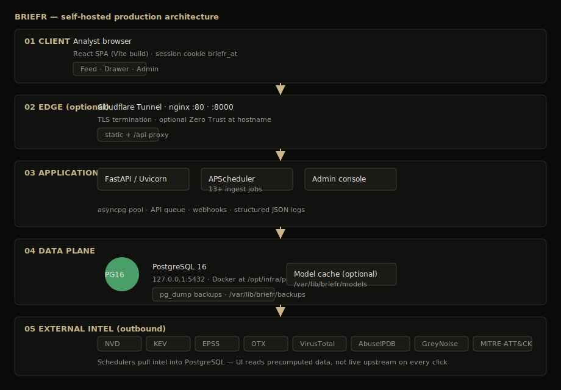
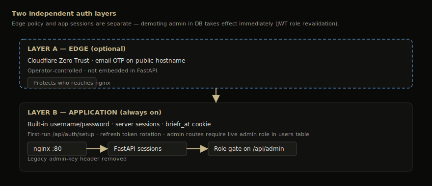
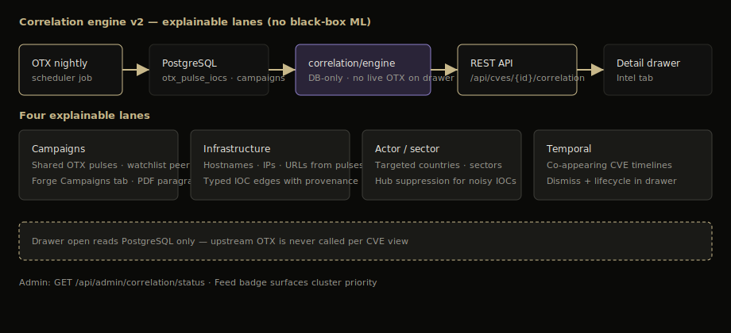

# How BRIEFR works

**Optional** — read this if you want the "why" behind the product. Skip if you only want to use or deploy it.

---

## Architecture

**Flow:** Browser → optional edge/nginx → FastAPI → PostgreSQL 16. Schedulers pull external intel into the DB; request handlers read cached/precomputed state.

**Auth:** Optional edge access can sit in front of built-in app login.

---

## Ingest and jobs

NVD, cvelistV5, CISA KEV, Vulnrichment, EPSS, OTX, MITRE ATT&CK/ATLAS, exploit sources, RSS × 5, and optional LLM/embedding jobs run on schedulers — not page load.

Outbound HTTP calls are paced by the API queue. Restart-sensitive work can use Procrastinate durable jobs (`PROCRASTINATE_ENABLED=1`), visible in Admin → Scheduler → Durable outbound jobs.

**Catch-up mode** is operator-triggered. It spends local headroom for a fixed window, kicks eligible backlog work, and still respects provider rate limits.

---

## Retrieval

FEED search is hybrid: keyword/CVE matching plus semantic retrieval when embeddings are enabled. Results can include ATT&CK techniques, campaigns, and CVEs.

Related-CVE retrieval falls back to product/keyword heuristics when embeddings or pgvector are unavailable. With `EMBEDDINGS_ENABLED=1` and Postgres + pgvector, local CPU embeddings add semantic similarity.

---

## Scoring

BRIEFR separates:

| Surface | Meaning |
|---------|---------|
| **Threat Score** | Asset-independent exploitation credibility |
| **Environment Relevance** | How much the CVE appears to matter to your stack/profile |
| **Operational Priority (OP)** | P1-P4 action band from Threat × Environment |
| **SSVC** | Parallel deployer-style annotation; it does not replace OP |

The drawer calls `POST /api/cves/{cve_id}/risk` with optional asset/profile context. Formula display weights are read separately from `GET /api/config/risk`.

---

## Correlation

Four explainable lanes: **Campaigns**, **Infrastructure**, **Actor/sector**, **Temporal**. OTX pulse titles are normalized for display, and pulse clusters show why members were grouped. No black-box ML score; drawer open does not call OTX live.

---

## Limits and queues

Inbound rate limits protect BRIEFR's own API (`RATE_LIMIT_ENABLED=1`). `BRIEFR_RATE_LIMIT_STORE=db` shares buckets across workers if you ever leave the default single-worker shape.

Provider pacing is separate: NVD can still return transient 503s; wait for cooldown rather than hammering refresh.

---

## Deeper reference

| Doc | When |
|-----|------|
| [`study-guide/`](https://github.com/Soldier0x0/briefr/tree/main/docs/study-guide/) | Primary generated architecture book |
| [`STUDY_GUIDE.html`](https://github.com/Soldier0x0/briefr/blob/main/docs/STUDY_GUIDE.html) | Editable standalone source for the book |
| [`ONBOARDING.md`](../developer-guide/onboarding.md) | Contributing code |
| [`API_REFERENCE.md`](../api-reference.md) | Every endpoint |
| [`SYSTEM_DESIGN.md`](../developer-guide/system-design.md) | Full architecture essay |
