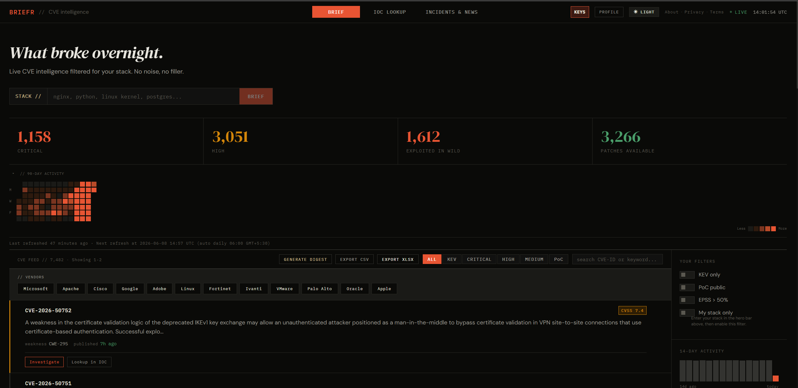
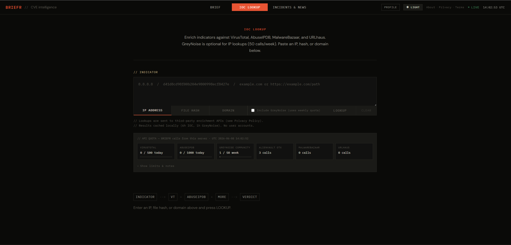

# Using BRIEFR

For analysts, security enthusiasts, and anyone using the UI — not deploying it.

---

## Tabs

| Tab | What you get |
|-----|----------------|
| **BRIEF** | Morning brief, what changed, heatmap, charts |
| **FEED** | Full CVE list, filters, KEV deadlines, export |
| **IOC LOOKUP** | IP / hash / domain enrichment |
| **INCIDENTS & NEWS** | RSS security news + MITRE ATLAS |
| **Forge** | Detection coverage, hunt packs |

> **Add:** `assets/ui-feed-tab.png` · [IMAGE_BRIEFS §12](https://github.com/Soldier0x0/briefr/blob/main/docs/IMAGE_BRIEFS.md#12-ui-feed-tab)

---

## CVE detail drawer

Click any CVE → drawer with Intel, Related, Detect, and more.

> **Add:** `assets/ui-detail-drawer.png` · [IMAGE_BRIEFS §13](https://github.com/Soldier0x0/briefr/blob/main/docs/IMAGE_BRIEFS.md#13-ui-detail-drawer)

**Correlation** (Intel tab) shows explainable links between CVEs — see [HOW_IT_WORKS.md](./how-it-works.md#correlation).

**Investigation:** pivot CVE → IOC → related CVE (session-only in browser).

---

## IOC lookup

Sources depend on your keys (VirusTotal, AbuseIPDB, GreyNoise, OTX, etc.). Results cached ~6 hours.

---

## Admin & wallboard

Operators: `/admin` for security, backups, jobs. Optional wallboard display with `WALLBOARD_TOKEN`.

> **Add:** `assets/ui-admin-security.png` · [IMAGE_BRIEFS §15](https://github.com/Soldier0x0/briefr/blob/main/docs/IMAGE_BRIEFS.md#15-ui-admin-security)

---

## Shortcuts

| Key | Action |
|-----|--------|
| `/` | Focus search |
| `F` | Cycle filters |
| `Esc` | Close drawer |
| `C` | Copy CVE markdown (drawer open) |

---

## Deploying?

That's a different doc → [SELF_HOST.md](../admin-guide/self-host.md)
