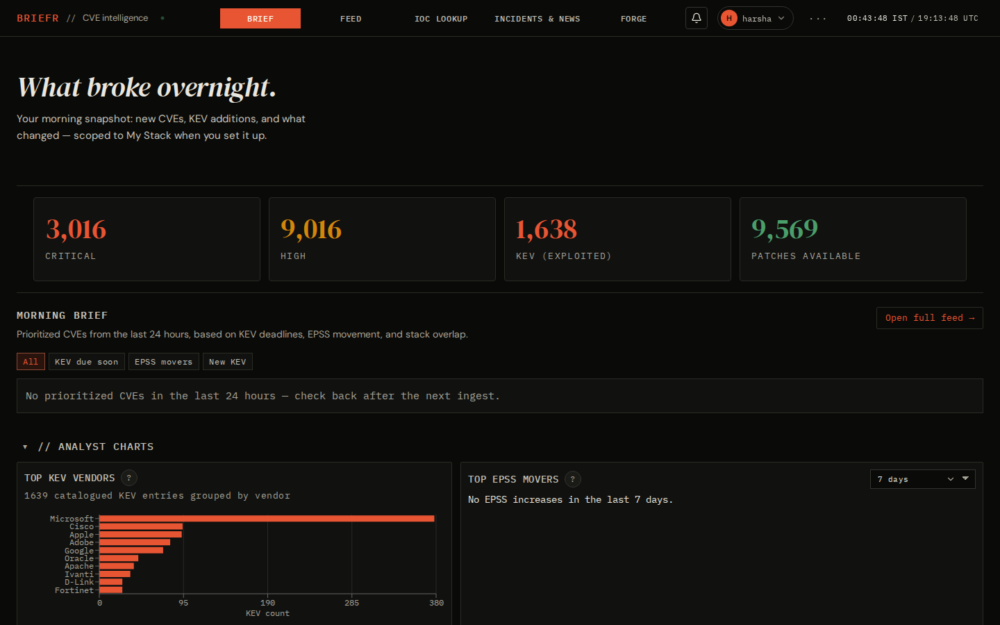
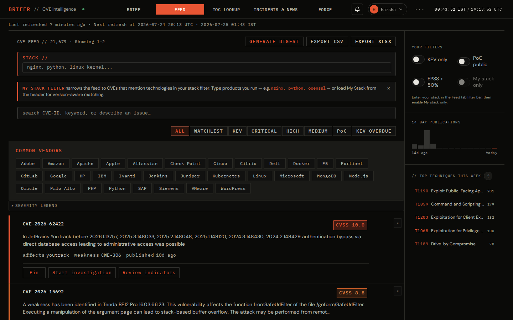
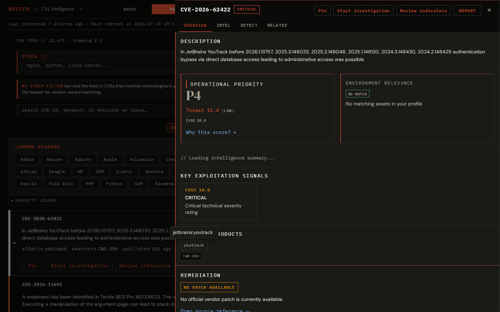
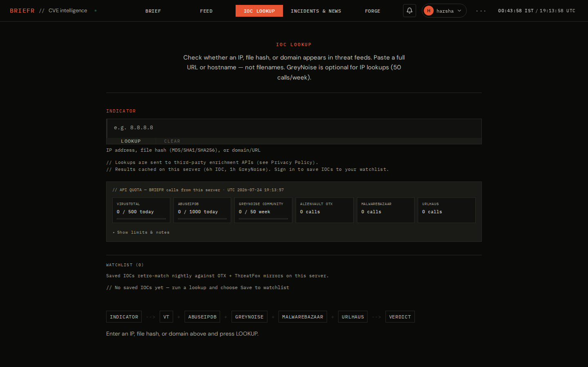

# Using BRIEFR

For analysts using the UI — not deploying it. Install guide: [SELF_HOST.md](../admin-guide/self-host.md).

**Try it first:** https://briefrdemo.projectjupiter.in — the live demo is a 1:1 copy of the analyst shell with fixture data (no login, no database). Buttons that need a backend (hunt-pack generation, live IOC enrichment) are visual-only. For a full deployment with live feeds, follow [SELF_HOST.md](../admin-guide/self-host.md).

---

## Screenshots

Click any image to expand inline on the docs portal. Regenerate captures: [`scripts/capture_readme_screenshots.mjs`](https://github.com/Soldier0x0/briefr/blob/main/scripts/capture_readme_screenshots.mjs) — see [IMAGE_BRIEFS.md](https://github.com/Soldier0x0/briefr/blob/main/docs/IMAGE_BRIEFS.md).

| BRIEF | FEED | CVE detail |
|-------|------|------------|
|  |  |  |

| IOC lookup | Incidents & news | Admin |
|------------|------------------|-------|
|  |  |  |

---

## Main shell

| URL tab | Header label | What you get |
|---------|--------------|--------------|
| `brief` | **BRIEF** | Morning queue, OP/Threat-ranked cards, charts, heatmap, what changed |
| `feed` | **FEED** | Full CVE list, filters, KEV deadlines, export, hybrid search |
| `ioc` | **IOC LOOKUP** | IP / hash / domain enrichment and investigation pivots |
| `investigate` | **INVESTIGATE** | Stored-intel graph (CVE / IOC / technique hops); pan/zoom, inspect/expand, filters; deep-link `?q=` |
| `atlas` | **ADVISORIES & INTEL** | Headlines, structured advisories, MITRE ATLAS |
| `forge` | **FORGE** | ATT&CK navigator, hunt packs, scenarios, campaigns, backlog, library |

Tab changes push browser history; hygiene cleanup replaces it. Back restores the last tab or Forge context. Opening a CVE writes `?cve=CVE-...`, so Back closes the drawer before leaving the page.

---

## FEED

Search is hybrid when a query is present: keyword/CVE hits plus semantic results. It can show **TECHNIQUES**, **CAMPAIGNS**, then **CVES** in one result set.

The stack filter is server-side. If BRIEFR needs historical coverage, FEED shows a backfill banner; approve it, watch progress, and resume if a run is deferred or partial.

Exports: CSV, Excel, selected-CVE PDF, and markdown copy.

---

## CVE detail drawer

Click any CVE. The drawer stays mounted while you switch drawer tabs.

| Tab | Order / purpose |
|-----|-----------------|
| **OVERVIEW** | Description → Operational Priority + Environment Relevance → Why this matters → CVSS/EPSS/exploitation → affected products → patch/references → SSVC/OSV |
| **INTEL** | Exploits, KEV, ATT&CK/ATLAS, GreyNoise, OTX pulses, active campaigns, explainable correlation |
| **DETECT** | Sigma, Elastic, SIEM queries, YARA, generated fallbacks |
| **RELATED** | Related CVEs and related news |

OTX pulse names are normalized with `formatIntelLabel`, so cluster labels stay readable. Pulse clustering is explainable: campaigns, shared infrastructure, actor/sector, and temporal lanes show why items are connected.

**Investigation:** pivot CVE → IOC → ATLAS/Forge/related CVE. The thread is session-only in the browser.

---

## IOC lookup

Sources depend on keys: VirusTotal, AbuseIPDB, GreyNoise, OTX, abuse.ch. Results cache about 6 hours; GreyNoise is opt-in per lookup.

---

## INVESTIGATE

Graph browser over stored CVE, IOC, technique, campaign, and publication hops — no live enrichment on each click. Open with `?tab=investigate&q=` (CVE, IP, hash, domain, or technique id).

**Navigation:** scroll to zoom (smoothed) · drag empty canvas to pan (inertia) · drag a node to rearrange · click to inspect · double-click to expand · Find + Enter flies the camera to a match. On a laptop without a scroll wheel, use **FIT GRAPH** (same as **RESET VIEW**) to frame the map.

Filters: **Related CVEs** (default **off** — first paint is the stored incident neighborhood; a banner shows the related-CVE count and **Show related CVEs**). Entity-type chips, edge-class chips, **Isolate**, **Find**, optional **Semantic**. Truncated neighborhoods show **LOAD MORE** on the selected node. The inspector lists evidence as `edge_class · source_key`. IOC nodes pivot via **LOOKUP LIVE** (correct `IocKind`); CVE scoring (KEV/EPSS) stays in **OPEN CVE**, not on graph nodes. Sigma nodes inspect only — no expand.

---

## Forge

Views: **ATT&CK navigator**, **Threat scenarios**, **Campaigns**, **Backlog**, **Library**.

The ATT&CK navigator is the primary workspace for CVE inventory and hunt-pack generation. Library packs can deep-link back into navigator context.

---

## Admin & wallboard

Operators use `/admin`: Scheduler includes **Catch-up mode** and the durable outbound jobs panel; Security posture lives inside Admin.

`/wallboard` is a read-only kiosk surface. It uses `WALLBOARD_TOKEN`, rotates OP/Threat-ranked CVEs, KEV-on-stack, campaign, source-health, and coverage-gap tiles.

---

## Shortcuts

| Key | Action |
|-----|--------|
| `/` | Focus FEED search |
| `F` | Cycle FEED filters |
| `g` then `d` | Generate digest from visible FEED cards |
| `↑` / `↓` | Move through FEED cards |
| `Enter` | Open highlighted CVE |
| `Esc` | Close the topmost drawer/modal |
| `C` | Copy CVE markdown (drawer open) |

Deploying? Read [SELF_HOST.md](../admin-guide/self-host.md).
